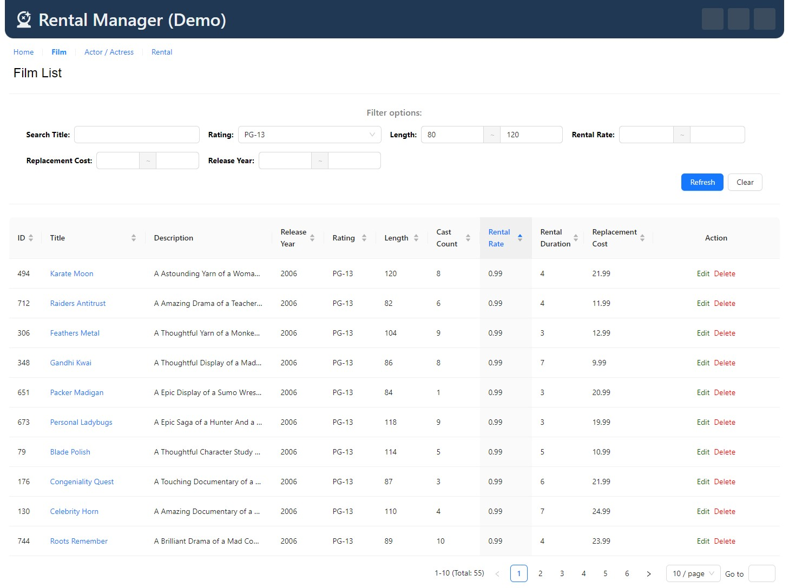

这是我使用Vue.js配合Ant Design Vue UI组件库开发的一个对rentaldvd这个postgresql样板数据库进行查看示例的项目。

实现的路由页面包含：
- 首页
- 影片列表
- 影片详情
- 演员列表
- 演员详情
- 租赁列表
- 租赁详情
- 客户详情

以下内容增减修改于Cursor AI claude-3.5-sonnet生成内容。

The following is adpted upon generated content by Cursor AI claude-3.5-sonnet
# DVD Rental Manager

A Vue 3 application for managing a DVD rental business, featuring film, actor, customer, and rental management.

## Features

- Dashboard with statistics and charts
- Film, actor, customer, and rental management
- Responsive design

## Tech Used

- Vue 3, TypeScript, Vite
- Pinia, Vue Router
- Ant Design Vue, Chart.js
- Axios, Dayjs

## Setup

1. Clone the repository
2. Install dependencies: `npm install`
3. Run development server: `npm run dev`

## Project Structure

- `src/`: Source files (components, views, stores, router, types)
- `public/`: Static assets

## API Configuration

API base URL is set in `src/main.ts`.

## Responsive Design

Managed by the global store in `src/stores/global.ts`.

## Key Components

- AppHeader, AppFooter
- ListSpaceBetween, ScrollingBoard
- LineChart

## Main Views

- HomeView, FilmListView, FilmDetailView
- ActorListView, ActorDetailView
- RentalListView, RentalDetailView
- CustomerDetailView

## Styling

Uses Ant Design Vue components and custom CSS in `src/App.css`.

## License

[MIT License](LICENSE)